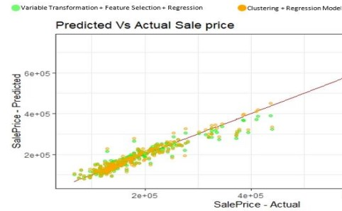

# About Me
I'm a Data Science Master's student from University at Buffalo graduating in December 2022. I'm actively looking for full-time job opportunities. 
[View Resume](Avash_Resume.pdf)

# Skills
- **Programming Languages:** Python, R, SQL, MATLAB
- **Database, Analytics & Visualization:** MS SQL, MySQL, PostgreSQL, SQLite, Excel, Tableau
- **Data Science and Machine Learning:** Numpy, Pandas, Matplotlib, Seaborn, Pytorch, Scikit-Learn, TensorFlow, Keras, OpenCV, RDKit, RShiny Dashboard
- **Version Control:** Git

# Projects

## [Web Traffic Analysis and Forecasting](https://github.com/avashneu/Web-Traffic-Analysis-and-Forecasting---Time-Series)
*<ins>Category</ins>: Time Series Analysis, Data Visualization, Forecasting, ARIMA, R, RShiny, Feature Engineering, Dashboard* 
*<ins>Tools</ins>: R, RShiny* 
[*View Dashboard*](https://uoocum-avash-neupane.shinyapps.io/Web-Traffic-Analysis-and-Forcasting/) *(Wait 1-2 minutes to load)*

-  Implemented multivariate time series forecasting to predict the web traffic density to provide insight into web traffic congestion and prevent unwanted outages.
-  Performed exploratory data analysis, feature engineering to generate relevant features from 145,000 time series for 550 days
-  Built ARIMA models to predict the future traffic of the website for the next 52 days.
-  Designed a user-friendly dashboard using RShiny app to display the analytical results and the forecast visualizations and results.

## [Geometric Deep Learning Methods with Deep Chemistry for Drug Pair Interactions](https://github.com/avashneu/cse676project)
*<ins>Category</ins>: Deep Learning, Autoencoders, Classification* 
*<ins>Tools</ins>: Python, Pytorch, RDKit*

- Developed a classifier model to solve drug-drug pair interaction outcomes from SMILES(Simplified Molecular Input Line Entry System) representation of drugs. 
- Converted the SMILES structure to molecular structure image in a feature space of 270,000, built an autoencoder network to capture and preserve important features in a 90% reduced dimensional latent space for efficient computation.
- Performed multiclass classification to predict an outcome from 86 different interaction types  a generalizable multiclass classification model with accuracy of 80%.

## [Ride Hailing Apps(Uber & Lyft) Price Prediction](https://github.com/avashneu/Ride-Hailing-Apps-Price-Prediction)
*<ins>Category</ins>: Data Visualization, Data Analysis, Neural Network, Database Normalization* 
*<ins>Tools</ins>: Python, SQLite3, Numpy, Pandas, Matplotlib, Seaborn, Keras, Scikit-Learn*
- Created normalized database in SQLite consisting of 5 tables through Python from dataset of 600k+ samples.
- Performed exploratory data analysis and data visualization using normalized database.
- Developed artificial neural network model to predict price of rides from provided features for ride hailing apps.

## [Housing Price Prediction](https://github.com/avashneu/Housing-Price-Prediction)
*<ins>Category</ins>: Multiple Linear Regression, Feature Selection, Clustering, Variable transformation* 
*<ins>Tools</ins>: R*

- Performed exploratory data analysis, transformed skewed variables, pre-processed data by employing data wrangling techniques, and selected important features out of 81 features leveraging stepwise selection method.
- Developed multiple linear regression to obtain a housing price prediction model with high accuracy.

## [Split It Out](https://github.com/avashneu/splititout)
*<ins>Category</ins>: OCR(Optical Character Recognition), Web App* 
*<ins>Tools</ins>: Python, OpenCV, Tesseract*

- Developed ‘Split it out’, a bill sharing app using OCR for bill information extraction, NLP for determining total amount and expense category.

## Image Processing based Traffic Management System
*<ins>Category</ins>: Image Processing* 
*<ins>Tools</ins>: Python, OpenCV*

- Architected traffic density management system with OpenCV for image processing and managed traffic lights using Raspberry pi.

